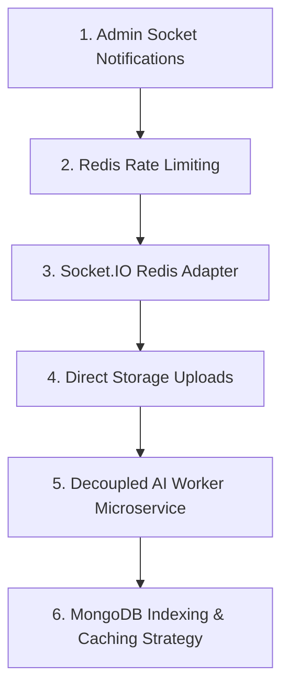

# 🚀 Scalability & Architecture Roadmap
## AI Government Complaint Portal

This document provides a comprehensive, production-grade scalability roadmap to transform the AI Government Complaint Portal into an enterprise-level system capable of handling thousands of concurrent citizens, officials, and background AI tasks smoothly.

---

## 📌 Roadmap Overview & Execution Priority



---

## 1. 🔔 Admin Real-Time Socket Notifications

### Objective
Ensure that whenever a new complaint is filed or sent to `ADMIN_REVIEW`, the Admin Dashboard updates dynamically without requiring a manual browser refresh.

### Implementation Steps

#### A. Backend Room Join ([`Backend/Socket/socket.js`](file:///d:/New%20folder/My%20Project/AI%20Government%20Complain/Government-Ai-Portal-main/Backend/Socket/socket.js))
Automatically join users with the `Admin` role to an `admin_room`:
```javascript
// Inside initializeSocket connection handler
if (socket.user.role === "Admin") {
    socket.join("admin_room");
    console.log(`Admin ${socket.user.id} joined admin_room`);
}
```

#### B. Emit Events on Complaint Submission / Review ([`Backend/Controller/Complain.js`](file:///d:/New%20folder/My%20Project/AI%20Government%20Complain/Government-Ai-Portal-main/Backend/Controller/Complain.js))
```javascript
const io = getIO();
if (io) {
    io.to("admin_room").emit("newComplaintSubmitted", {
        message: "New complaint submitted",
        complaint,
    });
}
```

---

## 2. 🛡️ Redis-Backed Rate Limiting & Anti-Spam Strategy

### Objective
Protect API endpoints (especially AI creation & login) against automated spam, bot flooding, and Denial of Service (DoS) attacks.

### Recommended Tool
`express-rate-limit` + `rate-limit-redis` (or `rate-limiter-flexible`).

### Implementation Strategy

1. **Complaint Submission Rate Limit**: Max **5 complaints per citizen per hour**.
2. **Authentication Rate Limit**: Max **10 login/signup attempts per IP per minute**.
3. **General API Rate Limit**: Max **100 requests per IP per minute**.

```javascript
// Middleware Example: Config/rateLimiter.js
const rateLimit = require("express-rate-limit");
const RedisStore = require("rate-limit-redis");
const { redisClient } = require("./redisCache");

const complaintCreateLimiter = rateLimit({
    store: new RedisStore({
        sendCommand: (...args) => redisClient.call(...args),
    }),
    windowMs: 60 * 60 * 1000, // 1 hour
    max: 5,
    message: {
        success: false,
        message: "Too many complaints created from this IP. Please try again after an hour.",
    },
});

module.exports = { complaintCreateLimiter };
```

---

## 3. 🔌 Socket.IO Multi-Instance Scaling (Redis Adapter)

### Problem
When scaling the backend across multiple server processes or nodes behind a Load Balancer (NGINX / AWS ALB), users connected to Server A won't receive events emitted on Server B.

### Solution
Implement `@socket.io/redis-adapter` using your existing Redis instance as a Pub/Sub message broker.

### Backend Setup
```bash
npm install @socket.io/redis-adapter ioredis
```

```javascript
// Backend/index.js
const { createAdapter } = require("@socket.io/redis-adapter");
const { Redis } = require("ioredis");

const pubClient = new Redis(process.env.REDIS_URL);
const subClient = pubClient.duplicate();

io.adapter(createAdapter(pubClient, subClient));
```

---

## 4. ⚡ Direct Cloud Storage Uploads (Bypass Express Memory)

### Problem
Streaming large image buffers through Express (`express-fileupload`) causes high RAM usage and blocks the Node.js single-threaded event loop during high concurrent uploads.

### Solution: Pre-Signed Direct Uploads
1. **Frontend** requests a signature token from `GET /api/v1/complain/upload-signature`.
2. **Frontend** uploads images directly from the browser to Cloudinary / AWS S3 via HTTP POST.
3. **Frontend** sends only the resulting secure URLs to `POST /api/v1/complain/create`.

### Benefits
* Reduces Express memory footprint by **up to 80%**.
* Eliminates server network bottlenecks during large file transfers.

---

## 5. ⚙️ Decouple AI Workers into Independent Microservices

### Problem
Running BullMQ worker jobs (`compliantWorker.js`) inside the main Express HTTP server process causes resource contention during Gemini vision & text processing.

### Solution
Separate the project execution into two distinct deployments:

1. **Web API Service**: Handles Express routes, HTTP validation, JWT auth, and Socket.IO.
2. **AI Queue Worker Service**: Dedicated background process running `compliantWorker.js` in a separate process container.

### BullMQ Exponential Backoff Configuration
```javascript
await complaintQueue.add(
    "analyzeComplaint",
    { complaintId: complaint._id },
    {
        attempts: 3,
        backoff: {
            type: "exponential",
            delay: 5000, // 5s, 10s, 20s retries on API rate limits
        },
        removeOnComplete: true,
    }
);
```

---

## 6. 🗄️ Database Indexing & Read Scalability (MongoDB)

### Compound Database Indexing
Add the following indexes to [`Backend/Models/Complain.js`](file:///d:/New%20folder/My%20Project/AI%20Government%20Complain/Government-Ai-Portal-main/Backend/Models/Complain.js) for high-speed queries:

```javascript
// Fast lookup for Citizen Dashboard
complainSchema.index({ citizen: 1, createdAt: -1 });

// Fast lookup for Official Dashboard
complainSchema.index({ assignedOfficial: 1, status: 1 });

// Fast lookup for Admin Dashboard & Filtering
complainSchema.index({ status: 1, department: 1, createdAt: -1 });
```

### Redis Caching for Read Operations
* Cache static and low-volatility data (e.g. Department lists, Official availability counts) with a 10-minute TTL.
* Invalidate cache keys (`admin:dashboard`, `departments:all`) whenever complaints are assigned or resolved.

---

## Summary Checklist

| Module | Task | Status / Action Needed |
| :--- | :--- | :--- |
| **Real-time Admin Feed** | Join admins to `admin_room` & emit submission events | ⏳ Next Immediate Step |
| **Rate Limiting** | Implement Redis rate limiter on `/create` and `/auth` | ⏳ Next Immediate Step |
| **Socket Scaling** | Add `@socket.io/redis-adapter` for multi-node support | 🚀 Architecture Enhancement |
| **Storage Optimization** | Pre-signed Cloudinary direct client uploads | 🚀 Memory Optimization |
| **Queue Worker Scaling** | Separate `compliantWorker.js` into distinct process | 🚀 Worker Microservice |
| **Database Performance** | Add MongoDB compound indexes on `Complain` schema | 🚀 DB Query Optimization |
